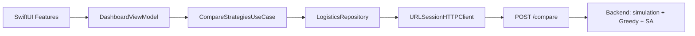

# Forklift Logistics iOS

Нативное iOS-приложение для моделирования и оптимизации внутризаводской логистики погрузчиков.

Проект помогает диспетчеру сформировать сценарий смены, запустить единый расчет и сравнить два подхода к построению расписания: быстрое жадное решение и оптимизацию методом имитации отжига. Результат раскрывается не только итоговыми числами, но и через таймлайн, журнал рейсов и статистику маршрутов.


## Зачем нужен проект

Внутризаводская логистика напрямую влияет на выпуск продукции: даже при исправной производственной линии участок может простаивать, если сырье и полуфабрикаты поступают несвоевременно. Диспетчеру приходится учитывать занятость погрузчиков, остатки в буферах, продолжительность рейсов, темп производства и приоритеты операций одновременно.

Проект основан на реальной постановке задачи для производства крупнощитовой опалубки «Гамма» в ООО «Техноком-БМ». Материальный поток проходит через последовательность технологических участков:


Участок окраски C3 является ключевым ограничением системы. Если он остается без деталей, производственная цепочка теряет время, которое уже невозможно компенсировать простым увеличением скорости последующих перевозок.

При планировании необходимо:

- выполнить сменный план по отгрузке щитов;
- сократить общую продолжительность расписания;
- минимизировать простои участка C3 и погрузчиков;
- соблюдать вместимость буферов и грузоподъемность техники;
- не назначать рейсы за пределами смены;
- сохранять понятную диспетчеру последовательность действий.

## Что умеет приложение

### Настройка сценария

Диспетчер задает числовые параметры смены в единой форме с точным вводом и кнопками быстрого изменения значения:

- сменный план и продолжительность смены;
- начальные остатки на производственных участках;
- время погрузки и разгрузки;
- время движения между участками;
- темп выпуска продукции;
- веса критериев целевой функции;
- параметры имитации отжига и seed генератора.

Поля проверяются до отправки, а значения по умолчанию позволяют сразу запустить демонстрационный сценарий.

### Единый расчет

После нажатия «Запустить расчет» приложение отправляет один запрос `POST /compare`. Пока сервер выполняет моделирование и оптимизацию, интерфейс показывает скелетон и сохраняет структуру будущего результата.

Ответ становится единым источником данных для всех экранов. Переходы между вкладками не создают повторных сетевых запросов и не запускают дополнительные вычисления.

### Анализ результата

- **Обзор** — сравнение ключевых показателей жадного алгоритма и имитации отжига.
- **Таймлайн** — последовательность событий и загрузка погрузчиков во времени.
- **Журнал рейсов** — подробности каждой перевозки с закрепленными фильтрами по погрузчику и стратегии.
- **Маршруты** — агрегированная статистика по направлениям движения.
- **Справка** — пояснения к показателям, параметрам и алгоритмам.

## Теоретическая основа

Задача относится к дискретному календарно-транспортному планированию. Ее состояние определяется запасами в узлах, занятостью погрузчиков, производственными событиями и оставшимся временем смены. Каждое решение изменяет условия для всех последующих рейсов, поэтому локально удобный выбор не всегда дает лучший итог для производственной системы.

### Почему не используется полный перебор

Количество возможных расписаний растет комбинаторно с числом рейсов. Полный перебор быстро становится непрактичным, а точные методы требуют сложной системы дискретных ограничений для порядка операций, буферов и событий во времени.

Классические подходы полезны, но имеют ограничения в этой постановке:

| Подход | Ограничение |
|---|---|
| Полный перебор | Комбинаторный взрыв числа расписаний |
| Линейное и целочисленное программирование | Громоздкое описание событийной динамики и порядка рейсов |
| Динамическое программирование | Быстрый рост пространства состояний |
| Графовые алгоритмы | Находят короткий путь, но не решают задачу очередности перевозок целиком |

Поэтому в проекте сравниваются понятная эвристика и метаэвристический поиск.

### Жадный алгоритм

Жадная стратегия формирует расписание последовательно, отдавая приоритет операциям ближе к отгрузке:

`C4 → P`, `C3 → C4`, `C2 → C3`, `C1 → C2`, `S → C1`.

Для каждого решения выбирается доступный погрузчик с минимальным холостым перемещением. Рейс добавляется только тогда, когда в исходном узле есть груз, в целевом буфере достаточно места, грузоподъемность не превышена, а операция завершится до конца смены.

Преимущества подхода — высокая скорость, детерминированность и объяснимость. Ограничение — зависимость от локальных решений: ранний удобный рейс может создать простой или дефицит дальше по цепочке.

### Метод имитации отжига

Simulated Annealing начинает поиск с допустимого жадного расписания и создает соседние варианты: меняет рейсы местами, переносит операции или перестраивает фрагмент последовательности. Каждый кандидат проигрывается дискретно-событийной моделью и получает оценку.

Улучшения принимаются всегда. Ухудшение может быть принято с вероятностью:

```text
P(accept) = exp(-ΔF / T)
```

В начале высокая температура `T` позволяет выходить из локальных минимумов. Затем температура уменьшается по закону `T ← αT`, поиск становится более консервативным и сходится к найденному хорошему решению. Фиксированный `seed` делает эксперимент воспроизводимым.

### Целевая функция

Качество расписания оценивается как взвешенная сумма четырех критериев:

```text
F(s) = 15000 * Q_shortfall
     +     1 * T_makespan
     +    25 * T_C3_idle
     +     4 * T_forklift_idle
```

где:

- `Q_shortfall` — невыполненная часть сменного плана;
- `T_makespan` — продолжительность расписания;
- `T_C3_idle` — простой критического участка окраски;
- `T_forklift_idle` — суммарный простой погрузчиков.

Чем меньше значение `F(s)`, тем лучше расписание. Большой вес дефицита отражает бизнес-приоритет: дополнительная единица выпущенной продукции важнее небольшого сокращения времени отдельного рейса. В интерфейсе веса можно менять и исследовать разные управленческие приоритеты.

## Что показало исследование

В одном из экспериментов выпускной квалификационной работы имитация отжига улучшила производственный результат относительно жадного расписания:

| Показатель | Жадный алгоритм | Имитация отжига | Изменение |
|---|---:|---:|---:|
| Отгружено щитов | 42 | 53 | +11 |
| Дефицит до плана | 46 | 35 | -11 |
| Значение целевой функции | 696 949 | 530 102 | -166 847 |
| Простой участка C3 | 4 ч 12 мин | 2 ч 58 мин | -1 ч 14 мин |
| Средний размер партии | 3,25 | 3,69 | +0,44 |
| Средняя загрузка погрузчика | 29,8% | 34,2% | +4,4 п.п. |

Это результат конкретного сценария, а не гарантия одинакового выигрыша для любых входных данных. Эксперимент также показал важный компромисс: число минут холостого пробега выросло, но производственная цепочка выпустила больше продукции и меньше простаивала. Именно поэтому приложение показывает набор метрик, а не сводит решение к одному «проценту эффективности».

## Архитектура приложения



Код организован по принципам Clean Architecture:

- **Presentation** — экраны SwiftUI, состояние интерфейса и переиспользуемая дизайн-система;
- **Domain** — бизнес-сущности, контракт репозитория и сценарий сравнения стратегий;
- **Data** — DTO, преобразование ответа API и реализация репозитория;
- **Core** — типизированный сетевой слой, конфигурация и общие утилиты.

`ContentView` собирает зависимости приложения: HTTP-клиент, репозиторий, use case и view model. Экранный код не знает деталей транспорта, а доменная модель не зависит от формата JSON.

### Один источник данных

Тяжелое вычисление выполняется на сервере один раз. Ответ содержит:

- исходный сценарий;
- результат жадной стратегии;
- результат имитации отжига;
- разницу между стратегиями;
- метрики, статистику маршрутов и полный журнал рейсов.

`DashboardViewModel` хранит этот результат и передает его всем вкладкам. Такое решение уменьшает сетевую нагрузку, предотвращает расхождение данных между экранами и делает навигацию мгновенной после завершения расчета.

> В этом репозитории находится нативный iOS-клиент. Вычислительное ядро с дискретно-событийной моделью и алгоритмами оптимизации работает на отдельном backend-сервисе и доступно через API.

## Структура проекта

```text
forklift-logistics-iOS/
├── App/                    # Точка входа и сборка зависимостей
├── Core/
│   ├── DesignSystem/       # Цвета, типографика и общие UI-компоненты
│   ├── Networking/         # Endpoint, HTTP-клиент и сетевые ошибки
│   └── Utilities/          # Форматирование и вспомогательная логика
├── Data/
│   ├── DTO/                # Контракты API
│   ├── Mapper/             # Преобразование DTO в domain entities
│   └── Repository/         # Реализация доступа к данным
├── Domain/
│   ├── Entities/           # Сценарий, стратегии, метрики и рейсы
│   ├── Protocols/          # Абстракции источников данных
│   └── UseCases/           # Сравнение стратегий
└── Features/
    ├── Dashboard/          # Сводное сравнение
    ├── ScenarioSetup/      # Настройка сценария
    ├── Timeline/           # События во времени
    ├── Trips/              # Журнал рейсов
    ├── Routes/             # Статистика маршрутов
    └── Help/               # Справочные материалы
```

## Технологии

- Swift 5 и SwiftUI;
- Observation (`@Observable`, `@Bindable`) для состояния интерфейса;
- Swift Concurrency (`async/await`) и `URLSession`;
- `Codable` для типизированного контракта API;
- SF Symbols и собственная дизайн-система;
- Clean Architecture и dependency injection без стороннего контейнера.

На стороне вычислительного сервиса используются дискретно-событийное моделирование, жадная эвристика и метод имитации отжига, разработанные и исследованные в рамках ВКР.

## Запуск проекта

Текущая конфигурация проекта использует Swift 5 и deployment target iOS 26.5.

```bash
git clone https://github.com/Ubskiy/forklift-logistics-iOS.git
cd forklift-logistics-iOS
open forklift-logistics-iOS.xcodeproj
```

После открытия выберите симулятор или подключенное устройство и запустите схему `forklift-logistics-iOS`. Для выполнения расчета нужен доступ к backend-сервису.

## API

Клиент использует один вычислительный endpoint:

```text
POST https://api.forklift-logistics.ru/compare
```

Запрос объединяет параметры сценария, начальные запасы, времена обработки и движения, производственные ограничения, веса целевой функции и настройки имитации отжига.

Ответ возвращает обе стратегии в одной согласованной модели:

```text
scenario
greedy
├── metrics
├── route_stats
└── trip_log
simulated_annealing
├── metrics
├── route_stats
└── trip_log
delta
```

Сетевые, серверные ошибки и ошибки декодирования преобразуются в типизированные состояния и отображаются пользователю с возможностью повторить расчет.

## Инженерные решения, на которые стоит обратить внимание

- Один тяжелый запрос обслуживает все аналитические экраны.
- Доменный слой отделен от JSON-контракта через DTO и mapper.
- Скелетон делает ожидание расчета предсказуемым и не «ломает» компоновку экрана.
- Точные числовые поля сочетаются с кнопками быстрого изменения параметров.
- Воспроизводимость эксперимента обеспечивается управляемым seed.
- Интерфейс показывает не только победителя, но и цену компромисса между выпуском, простоями, загрузкой и холостыми перемещениями.
- Общая дизайн-система поддерживает единые отступы, карточки, типографику и поведение заголовков на всех вкладках.

## Ограничения и развитие

Проект демонстрирует законченную цепочку от постановки производственной задачи до анализа рассчитанного расписания, но остается пространство для развития:

- покрыть domain- и data-слои unit-тестами, а ключевые сценарии — UI-тестами;
- добавить локальный кэш последнего успешного расчета и офлайн-просмотр;
- поддержать отмену и фоновое выполнение длительного расчета;
- добавить версионирование API и телеметрию времени вычисления;
- расширить модель на произвольное число погрузчиков и производственных узлов;
- сохранять и сравнивать несколько пользовательских сценариев.

Имитация отжига является метаэвристикой: она ищет качественное решение за приемлемое время, но не доказывает достижение глобального оптимума. Для практической диспетчеризации это осознанный баланс между качеством расписания, объяснимостью и стоимостью вычислений.

## Происхождение проекта

Теоретическая постановка, математическая модель, алгоритмы и экспериментальная проверка разработаны в выпускной квалификационной работе А. Н. Убского «Разработка алгоритма для решения транспортной задачи в строительной отрасли», НИУ «МЭИ», 2026.

Мобильное приложение развивает исследовательский прототип в сторону полноценного инструмента: отделяет вычислительное ядро от клиента, дает диспетчеру управляемый сценарий и превращает результат оптимизации в понятный интерфейс для принятия решений.
